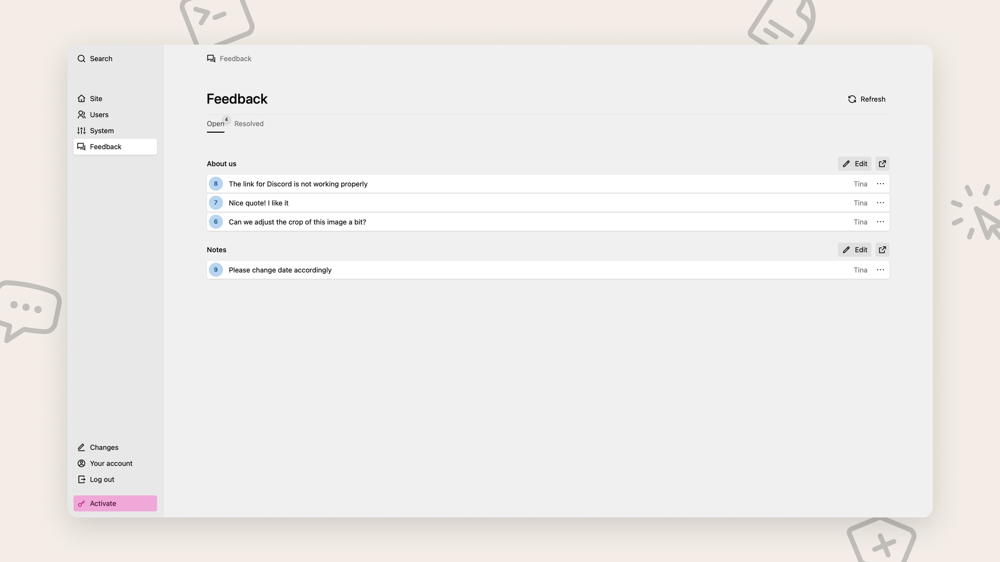

# Kirby Loop

Stay in the loop. A visual feedback plugin for Kirby CMS: click anywhere on a page to leave a comment, reply in threads, and resolve discussions, right where the content lives. Made for client reviews and team feedback.

## Features

- **Click-to-comment**: switch to comment mode and click any element to attach feedback to it
- **Threaded discussions**: reply to comments and mark them as resolved
- **Panel integration**: a global Feedback area in the Kirby Panel plus a per-page comments section for page blueprints
- **Multi-language**: works with Kirby's multi-language sites, UI language auto-detected
- **Public or users only**: restrict commenting to authenticated users or open it up to the public
- **Theming**: light/dark themes included, custom themes possible
- **Self-contained**: everything is stored in a local SQLite database, no external services

## Quick Start

```bash
composer require moinframe/kirby-loop
```

The feedback widget is automatically injected on all pages for authenticated users.

## Configuration

All options go into `site/config/config.php`:

```php
return [
    // Enable/disable loop (default: true)
    'moinframe.loop.enabled' => true,

    // Or use a callback for conditional enabling
    'moinframe.loop.enabled' => function($page) {
        return in_array($page->template()->name(), ['article', 'blog']);
    },

    // Disable auto-injection (default: true)
    'moinframe.loop.auto-inject' => false,

    // Set header position: 'top' or 'bottom' (default: 'top')
    'moinframe.loop.position' => 'bottom',

    // Allow guest comments (default: false - requires auth)
    'moinframe.loop.public' => true,

    // Force UI language (default: null - auto-detect)
    'moinframe.loop.language' => 'de',

    // Set theme: 'default', 'dark', or custom theme name
    'moinframe.loop.theme' => 'dark',
];
```

## Panel View



Since 1.1.0 comments also show up in the Kirby Panel. A global **Feedback** area in the Panel menu lists all comments across the site, grouped by page. There's also a `loop-comments` blueprint section to show a page's comments right where editors work:

```yaml
sections:
  feedback:
    type: loop-comments
```


See the [Panel docs](https://moinfra.me/docs/moinframe-loop/panel) for permissions and how to hide the area for certain roles.

## Documentation

- [Installation](https://moinfra.me/docs/moinframe-loop/installation)
- [Configuration](https://moinfra.me/docs/moinframe-loop/configuration)
- [Multi-Language](https://moinfra.me/docs/moinframe-loop/multi-language)
- [Theming](https://moinfra.me/docs/moinframe-loop/theming)
- [Panel](https://moinfra.me/docs/moinframe-loop/panel)
- [API](https://moinfra.me/docs/moinframe-loop/api)

## Requirements

- Kirby CMS 4.0+
- PHP 8.3+
- SQLite support

> [!WARNING] Caching
> Pages with the snippet automatically have Kirby's page **cache disabled**. This is necessary for CSRF token validation and user authentication checks.

## Support

Found a bug? Report it on [GitHub Issues](https://github.com/moinframe/kirby-loop/issues).

## License

MIT License - see [LICENSE.md](LICENSE.md)
